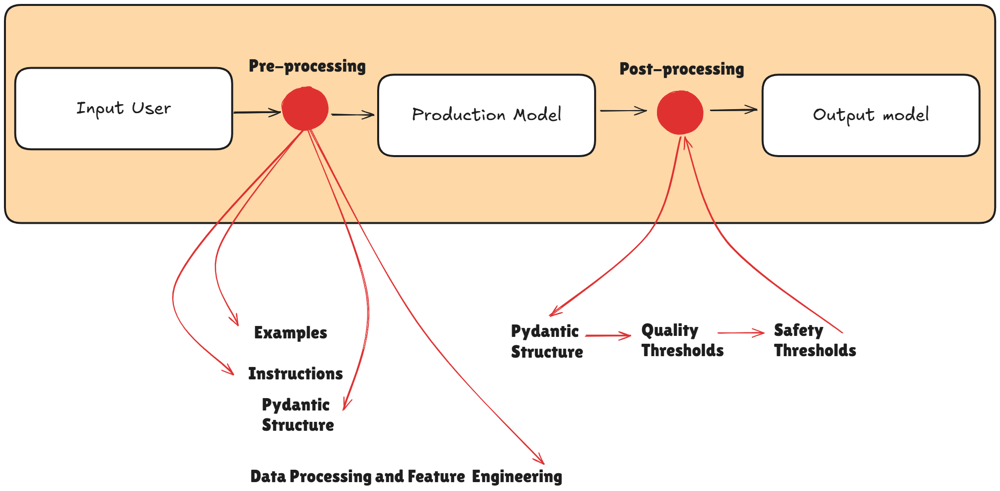

# Serving

## modulo `preprocessing`

`user query` + (`examples`, `instruction`) -> `structured input`

## modulo `modeling`

* `(finetuned) embedding (encoder) model (e.g., bert)`

* `retriever model (e.g., k-neirest-s)`

* `(finetuned) generative (decoder) model (e.g., gpt-oss)`

## modulo `postprocessing`

`model response` -> `structured output` -> `quality score` -> `safety score`